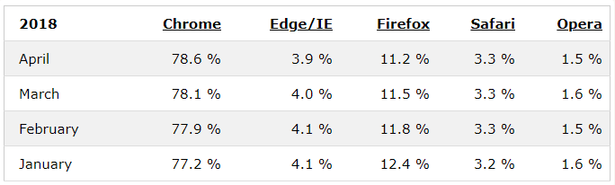

###### Esther Nieto Medina 2º DAW

###### Proyecto 1 DWEC

# - *ÍNDICE* -

- ####  1. Modelos de Programación en Entornos Cliente/Servidor.
    - ***1.1** ¿Cuales son los modelos cliente/servidor más comunes?*
    - ***1.2** Identifica ejemplos de aplicaciones que utilizan cada modelo.*

- #### 2. Mecanismos de Ejecución de Código en un Navegador Web. Capacidades y Limitaciones de Ejecución. Compatibilidad con Navegadores Web.
    - ***2.1** ¿Cómo se ejecuta el código JavaScript en un navegador?*
    - ***2.2** Diferencias de compatibilidad entre navegadores.*
    - ***2.3** Resolución de problemas de compatibilidad en una aplicación web.*

- #### 3. Lenguajes de Programación en Entorno Cliente.
    - ***3.1** Investigación de lenguajes como JavaScript, TypeScript, y otros.*
    - ***3.2** Comparación de sus características y aplicaciones.*

- ### 4. Características de los Lenguajes de Script. Ventajas y Desventajas.
    - ***4.1** Análisis de las ventajas y desventajas de la programación en lenguajes de script sobre la programación tradicional.*

- ### 5. Tecnologías y Lenguajes Asociados. Integración del Código con las Etiquetas HTML.
    - ***5.1** Exploración de tecnologías como CSS y HTML5.*
    - ***5.2** Creación de una pequeña aplicación web integrando código JavaScript de diferentes maneras.*

- ### 6. Herramientas de Programación.
    - ***6.1** Uso de herramientas como Visual Studio Code, Chrome DevTools, etc.*

---

# Explorando los Fundamentos del Desarrollo Web en Entornos de Cliente

### 1. Modelos de Programación en Entornos Cliente/Servidor

Según Wordpress (https://programacionviiulatbysslender.wordpress.com/2016/07/20/modelos-de-programacion-en-entornos-clientes-servidor/), el modelo cliente/servidor consiste en un cliente que solicita unos servicios que son concedidos por un servidor. Este modelo es uno de los más usados por servicios y protocolos web, por lo que aprender sobre ello, en mi opinión, es valioso.

###### *1.1 ¿Cuales son los modelos cliente/servidor más comunes?*

La arquitectura de una web es, esencialmente, la manera en la que los elementos y las partes de una web se comunican entre sí.

Hay diferentes formas de abordar la arquitectura de los modelos cliente/servidor, pero algunas de las más comunes las encontramos en (https://kinsta.com/es/blog/arquitectura-aplicaciones-web/), y son:

- **Aplicación de una sola página o Single Page Application (SPA):** Este modelo consiste en una página en la que toda la información se mantiene igual, excepto ciertas partes que se actualizan aisladas del resto. Este tipo de arquitectura tiene grandes ventajas, como por ejemplo, los tiempos de carga son menores para los usuarios, y el servidor no requiere enviar tanta información junta.

- **Aplicaciones web progresivas o Progressive Web Apps (PWA):** Esta estructura es la de una página única. Las PWAs funcionan offline gracias a que el contenido mínimo se guarda y de esta manera se muestra siempre, aunque no se disponga de internet una vez accedido a la página. Esto también es debido a que dispone de un service worker, que consiste en un archivo JS que continúa ejecutándose en segundo plano y permite el funcionamiento de la web sin internet (entre otras cosas). Esta arquitectura tiene ciertas ventajas como la fluidez de la web y el acceso de los desarrolladores sin conexión.

- **Renderizado del Lado del Servidor (SSR):** Este modelo consiste en el renderizado de las páginas web del frontend en un servidor backend cuando son solicitadas por el usuario. Esto tiene como ventaja que tiene poco impacto en el dispositivo del usuario al recibir una web estática como respuesta (HTML, CSS y JS) y la primera carga es enormemente rápida.

- **Aplicaciones Prerrenderizadas:** Esta arquitectura permite que las páginas web del frontend se generen y almacenen como archivos HTML, CSS y JS, obteniéndose y mostrándose casi instantáneamente, sin embargo durante la construcción de la página es donde ocurre la renderización de la misma, lo que podría ser un inconveniente.

###### *1.2 Identifica ejemplos de aplicaciones que utilizan cada modelo*

Según los artículos de Wikipedia de cada modelo:

- **Aplicación de una sola página o Single Page Application (SPA):** Un ejemplo de una SPA es el correo electrónico o gmail. Cuando navegamos por la página hay pocas cosas que cambian o se actualizan, el encabezado, por ejemplo, permanece igual. Otro ejemplo es la web de Netflix.

- **Aplicaciones web progresivas o Progressive Web Apps (PWA):** De este tipo de estructura hay muchos ejemplos, como Twitter, Facebook, Google Maps, Uber, etc.

- **Renderizado del Lado del Servidor (SSR):** La arquitectura de SSR es muy popular entre los blogs y sitios de comercio electrónico, gracias a la facilidad del SEO y la gestión de enlaces.

- **Aplicaciones Prerrenderizadas:** De nuevo, para blogs o detalles de productos que no cambian mucho.

### 2. Mecanismos de Ejecución de Código en un Navegador Web. Capacidades y Limitaciones de Ejecución. Compatibilidad con Navegadores Web

###### *2.1 ¿Cómo se ejecuta el código JavaScript en un navegador?*

En Chrome tenemos la opción de crear Snippets (definidas como pequeños fragmentos de código), lo que nos permite ejecutar código JavaScript en el navegador. Siguiendo los pasos desarrollados en (https://apuntes.de/javascript-estructuras-de-datos-y-algoritmos/ejecutar-codigo-javascript-en-chrome/#gsc.tab=0), podemos crear un snippet desde la consola del mismo navegador desde **Sources > Snippets > + New Snippet**. A este Snippet le ponemos el nombre deseado y escribimos **console.log("texto");**

A continuación presionamos **CTRL+Enter** o **CMD+Enter** que ejecutará el programa y podremos ver la salida en la misma consola.

En cualquier otro navegador, podemos usar la herramienta de inspeccionar y seleccionar la consola en DevTools. Aquí podemos empezar libremente a programar con JavaScript.

###### *2.2 Diferencias de compatibilidad entre navegadores*

Existen numerosos navegadores hoy en día, pero no todos son iguales, por ello tenemos que tener en cuenta lo que conocemos como la compatibilidad de las páginas web con los distintos navegadores, ya que las páginas no se ven iguales en todos ellos.

Solemos querer establecer una buena compatibilidad con los navegadores más usados actualmente. Esta tabla muestra los más usados de distintos meses de 2018, que nos puede servir como guía:

###### *2.3 Resolución de problemas de compatibilidad en una aplicación web*

Para obtener una web compatible con un navegador, en (https://comparium.app/es/blog/cross-browser-compatibility-issues/) nos aconsejan validar el código HTML y CSS empleado en esa web. Si hacemos esto, podremos conseguir una web mucho más fácil de mantener. También podemos cuidar las técnicas que usamos de CSS, y cercionarnos de que estas son adecuadas y soportadas por los navegadores que queremos que sean compatibles con nuestra web.

Por otro lado es conveniente incluir hojas de estilo de reset CSS para que no haya problemas con las diferencias entre nuestro código y el predeterminado del navegador en cuestión. Por último y entre otras cosas, debemos analizar si alguna función de JavaScript está dando problemas de compatibilidad con el navegador usando herramientas como Caniuse o Babel for JavaScript Transpiling. Otra solución a este problema es usar archivos JS de terceros o Linters (herramienta que mejora el código y analiza en busca de errores e incompatibilidades)

### 3. Lenguajes de Programación en Entorno Cliente.

###### *3.1 Investigación de lenguajes como JavaScript, TypeScript, y otros*

- **JavaScript:** Según (https://developer.mozilla.org/es/docs/Web/JavaScript) y Wikipedia (https://es.wikipedia.org/wiki/JavaScript), JavaScript es un lenguaje de programación de Scripting (secuencias de comandos) registrado de Oracle (en EEUU y otros países) e interpretado que es usado para el desarrollo de páginas web. Fue desarrollado principalmente con el nombre de *Mocha*, para más adelante ser cambiado a *LiveScript* y finalmente terminar con el nombre de *JavaScript*.

En cuanto a la gramática básica de JavaScript, nos damos cuenta de que es un lenguaje altamente influenciado por Java, C, Python, etc. Este lenguaje distingue entre mayúsculas y minúsculas, es decir, es *case-sensitive*. Por ejemplo, podemos denominar a una variable *Contador* y será diferente de la variable *contador*. También, entre otras muchas cosas, apreciamos que no requiere de punto y coma al final de una declaración escrita en su propia línea (pero sí al final de la línea general), pero si queremos escribirlo no va a causarnos ningún error o problema.

- **TypeScript:** TypeScript es una extensión del lenguaje anteriormente estudiado, JavaScript. Esta extensión destaca por aumentar y ampliar la sintaxis en el ámbito de los tipos. También es muy útil para revisar los errores en el código.

Algunas ventajas de TypeScript listadas en (https://keepcoding.io/blog/typescript/#:~:text=TypeScript%20es%20una%20extensi%C3%B3n%20al,en%20cualquier%20escala%20de%20proyectos.) son la robustez, la flexibilidad (porque podemos usarlo tanto en frontend como en backend) y la rapidez en el proceso de desarrollo.

Otros lenguajes que permiten script:

- **Python:** Python es un lenguaje de programación que es comúnmente usado para el desarrollo de páginas web, desarrollo de software, etc. Es un lenguaje que se ha viralizado porque es muy fácil de aprender (sobretodo útil para empezar a programar) y permite desarrollar con rapidez.

Algunas ventajas que vemos en (https://aws.amazon.com/es/what-is/python/) son su básica sintaxis, como antes he explicado, sus numerosos recursos disponibles, etc.

- **PHP:** Según Wikipedia (https://es.wikipedia.org/wiki/PHP) PHP es un lenguaje de programación interpretado del lado del servidor usado normalmente para el desarrollo de páginas web, que actualmente se encuentra instalado en más de 20 millones de sitios web y en un millón de servidores.

Su sintaxis es fundamentada por los inicios del lenguaje C, y el código debe estar entre limitadores (*<?php* y *?>*) para ser ejecutado. Las variables se establecen usando el símbolo *$* y se también es *case-sensitive* como JavaScript.

###### *3.2 Comparación de sus características y aplicaciones**

Un resumen o reflexión de lo leído en (https://www.itdo.com/blog/que-es-typescript-y-por-que-utilizarlo/) y Wikipedia (artículo de TypeScript y JavaScript) me ha llevado a estas conclusiones:

Empezando por TypeScript, tiene una gran ventaja que es la escritura estática que permite utilizar variables sin declararlas previamente a usarlas, además de muchos servicios que no contiene JavaScript. Se usa para evitar errores ocultos y refactorizar código sin grandes repercusiones entre otras cosas.

TypeScript y JavaScript son ambos lenguajes de scripting orientado a objetos, pero TypeScript es un lenguaje dependiente, compilado y tipado estáticamente y JS es independiente, interpretado y tipado dinámicamente, además de que se usa para el desarrollo de aplicaciones web.

Python permite la automatización de scripts, encontrar errores en varios archivos, descargar contenido, convertir un archivo en otro tipo de archivo, etc. Es usado para el desarrollo de apliaciones web y software, y para la ciencias de datos y el machine learning.

PHP tiene varias características como gran extensión de documentación, muchas herramientas diferentes para iniciarnos en el lenguaje, permite la programación orientada a objetos, además de ser totalmente libre y multiplataforma. Se usa para desarrollar aplicaciones web.

### 4. Características de los Lenguajes de Script. Ventajas y Desventajas

###### *4.1 Análisis de las ventajas y desventajas de la programación en lenguajes de script sobre la programación tradicional*

Como podemos ver en (https://aulab.es/noticia/202/que-es-un-lenguaje-de-scripting#:~:text=Ventajas%20y%20desventajas%20de%20los%20lenguajes%20de%20scripting&text=Generalmente%20tienen%20una%20sintaxis%20m%C3%A1s,te%20permiten%20crear%20p%C3%A1ginas%20atractivas.), los lenguajes de scripting tienen muchas ventajas pero también algunas desventajas.

La primera ventaja que observamos es que los lenguajes de scripting son de código abierto, por eso pueden ser ampliados y mejorados por la comunidad. Otra ventaja es que no necesita compilación, pues ejecutan el código fuente directamente.

También es una gran ventaja que los lenguajes de scripting tienen una sintaxis mucho más simple, por lo que son más fáciles de aprender y los scripts pueden ser transferidos de un sistema operativo a otro sin problemas mayores.

Por otro lado, los lenguajes de script tienen alguna desventaja frente a los lenguajes de programación tradicional, entre las que se encuentran que son usadas exclusivamente para el ámbito del desarrollo web, pero los lenguajes de programación tradicional pueden ser usados para un abanico más amplio de opciones (software, desarrollo web, etc.).

 ### 5. Tecnologías y Lenguajes Asociados. Integración del Código con las Etiquetas HTML

 ###### *5.1 Exploración de tecnologías como CSS y HTML5*

Las tecnologías HTML5 y CSS son lenguajes de marcas muy importantes para el desarrollo de aplicaciones web que nos van a permitir crear contenido interactivo y atractivo visualmente.

A lenguajes de marcas como HTML5 y CSS, le envuelven otras tecnologías que lo complementan y proporcionan dinamismo a aquello que desarrollamos con las mismas.

Algunas son JavaScript, que ya conocemos, pero otras no nos suenan tanto. En este punto vamos a repasar algunas de ellas gracias al contenido de (https://www.mediummultimedia.com/web/que-otras-tecnologias-se-usan-en-html5/).

La primera SVG (Scalable Vector Graphics), que es una tecnología con la que podemos crear gráficos y animaciones vectoriales simples o complejas para nuestra web, siendo estos mucho más nítidos a cualquier escala y mejores en general que imágenes comunes.

Otra herramienta es Canva, que nos permite crear gráficos y animaciones con JavaScript en un área de dibujo. También podemos crear otras cosas como juegos, obras interactivas, etc.

Por último, encontramos WebRTC (Web Real-Time Communication), que posibilita la comunicación a tiempo real de unos navegadores con otros sin necesitar softwares extras o plugins y la realización de videoconferencias, compartir datos y transmitir audio y vídeo en el navegador.

###### *5.2 Creación de una pequeña aplicación web integrando código JavaScript de diferentes maneras*

Para hacer esto, primero debemos descubrir cómo integrar código JS en HTML, lo cual viene muy bien explicado en (https://www.hostinger.mx/tutoriales/insertar-javascript-en-html/#:~:text=Agregar%20JavaScript%20directamente%20a%20un%20archivo%20HTML,-La%20primera%20forma&text=Puedes%20hacerlo%20utilizando%20la%20etiqueta,entre%20las%20etiquetas)

Siguiendo las instrucciones de esta página, he creado un pequeño trozo de código que crea una mini web con un botón. Cuando el usuario hace click en el botón, una pantalla emergente aparece con el mensaje *Hola Mundo*:

~~~
<!DOCTYPE html>
<html lang="es">
<head>
    <meta charset="UTF-8">
    <meta name="viewport" content="width=device-width, initial-scale=1">
    
    <title>Ejercicio 5.2 Proyecto 1 DWEC</title>
</head>
<body>
    <button onclick="botonEjemplo()">Descubrir el mensaje oculto</button>
</body>
</html>
~~~

Otra manera de integrar JS en un código HTML es haciendo referencia a un archivo JavaScript (archivo.js) externo. Este sería el mismo ejemplo anterior hecho de la manera que acabo de comentar:

~~~
<!DOCTYPE html>
<html lang="es">
<head>
    <meta charset="UTF-8">
    <meta name="viewport" content="width=device-width, initial-scale=1">
    
    <title>Ejercicio 5.2 Proyecto 1 DWEC</title>
</head>
<body>
    <button onclick="botonEjemplo()">Descubrir el mensaje oculto</button>
</body>
</html>
~~~

### 6. Herramientas de Programación

###### *6.1 Uso de herramientas como Visual Studio Code, Chrome DevTools, etc.*

Tanto Visual Studio Code como Chrome DevTools son herramientas destinadas el desarrollo de aplicaciones web, sin embargo entre ambas existen enormes diferencias.

Como podemos leer en (https://openwebinars.net/blog/que-es-visual-studio-code-y-que-ventajas-ofrece/), VSCode es un editor de código fuente multiplataforma y de software libre. Esta herramienta nos da acceso a extensiones complementarias que permiten que este editor se convierta en una herramienta muy fuerte y dinámica para el desarrollo, ya que, una de las cosas más útiles que nos permite hacer, es escribir y ejecutar código en cualquier lenguaje de programación del que instalemos el plugin, y gracias a su compatibilidad con Git, permite el uso del control de versiones.

Por otro lado, Chrome DevTools se resume en un conjunto de herramientas para el desarrollo web integrado en el mismo navegador de Chrome.

En (https://imacreste.com/que-es-y-porque-usar-devtools/) podemos ver algunas de las opciones de esta herramienta de navegador:

- **Pestaña console:** Esta pestaña nos permite escribir en JavaScript y ejecutar el código.
- **Pestaña Elements:** En esta pestaña encontramos la visualización y posibilidad de edición de código HTML y CSS, así como realizar pruebas y revisar el código fuente de un elemento.
- **Pestaña security:** Nos permite comprobar si hay algún problema de seguridad.
- **Pestaña performance:** En esta pestaña observamos el rendimiento de nuestra web al cargar.
- **Modo móvil:** Si activamos esta opción, nuestra web aparecerá emulada como si la viéramos desde un dispositivo móvil.
- **Pestaña source:** Esta pestaña es usada para la depuración de código en JS y la detección de errores en el mismo.

En conclusión, estas y muchas más opciones hacen de DevTools una herramienta muy útil y accesible.

Otras herramientas usadas para el desarrollo de aplicaciones web puede ser Github, Figma o WordPress (entre otras muchas), las cuales vamos a repasar:

- **GitHub** es una herramienta extensamente usada por los desarrolladores de todo tipo. Según (https://www.xataka.com/basics/que-github-que-que-le-ofrece-a-desarrolladores) GitHub es un sistema de control o gestión de versiones que nos permite actualizar nuestro código y llevar en común un proyecto haciendo el uso de los repositorios. Esta herramienta es indispensable en casi todos los entornos del desarrollo web.

- **Figma**, como leemos en (https://www.pixartprinting.es/blog/figma-que-es/), consiste en una plataforma online editora de gráficos vectoriales destinada al uso de desarrollado de aplicaciones web. Esta herramienta se enfoca en el diseño de interfaces y el diseño gráfico, que igualmente es una parte imprescindible durante el proceso de desarrollo de una página web.

Esta herramienta destaca en el hecho de que es *colaborativa*, lo que quiere decir que varias personas pueden participar en un proyecto, haciendo que Figma sea una opción muy útil y viable para las empresas de desarrollo. El hecho de que sea online significa que el acceso a este instrumento de desarrollo se puede realizar desde el mismo navegador y todo se guarda en la nube a tiempo real, y por último, también es una enorme ventaja que sea gratuita.

- **WordPress** es un sistema gestor de contenido que permite la creación de blogs y sitios web de manera muy sencilla. En (https://blog.hubspot.es/website/guia-completa-wordpress) encontramos que WordPress es enormemente usado para Blogging como ya hemos dicho, creación de comercio en línea con la ayuda de plugins como *WooCommerce* o personalización de Portafolios profesionales entre otras muchas cosas.

Todas estas y más son herramientas que han sido usadas durante estos años por los desarrolladores web y que, a día de hoy, han construido alrededor de ellas mismas una reputación y fama merecida por sus propias características innovadoras.