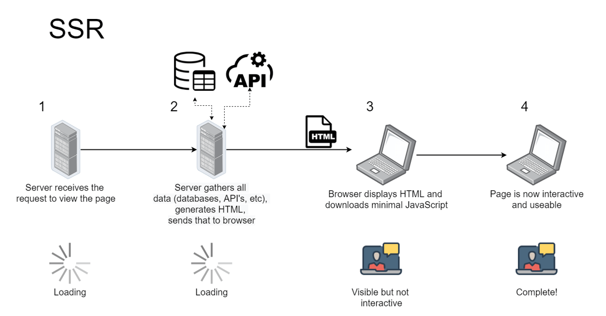
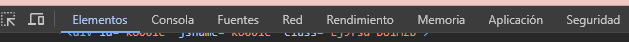

---
# - ÍNDICE -

- ####  1. Modelos de Programación en Entornos Cliente/Servidor.
    - ***1.1** ¿Cuales son los modelos cliente/servidor más comunes?*
    - ***1.2** Identifica ejemplos de aplicaciones que utilizan cada modelo.*

- #### 2. Mecanismos de Ejecución de Código en un Navegador Web. Capacidades y Limitaciones de Ejecución. Compatibilidad con Navegadores Web.
    - ***2.1** ¿Cómo se ejecuta el código JavaScript en un navegador?*
    - ***2.2** Diferencias de compatibilidad entre navegadores.*
    - ***2.3** Resolución de problemas de compatibilidad en una aplicación web.*

- #### 3. Lenguajes de Programación en Entorno Cliente.
    - ***3.1** Investigación de lenguajes como JavaScript, TypeScript, y otros.*
    - ***3.2** Comparación de sus características y aplicaciones.*

- ### 4. Características de los Lenguajes de Script. Ventajas y Desventajas.
    - ***4.1** Análisis de las ventajas y desventajas de la programación en lenguajes de script sobre la programación tradicional.*

- ### 5. Tecnologías y Lenguajes Asociados. Integración del Código con las Etiquetas HTML.
    - ***5.1** Exploración de tecnologías como CSS y HTML5.*
    - ***5.2** Creación de una pequeña aplicación web integrando código JavaScript de diferentes maneras.*

- ### 6. Herramientas de Programación.
    - ***6.1** Uso de herramientas como Visual Studio Code, Chrome DevTools, etc.*

---
# 1. Modelos de Programación en Entornos Cliente/Servidor.
### 1.1/2 ¿Cuales son los modelos cliente/servidor más comunes? Identifica ejemplos de aplicaciones que utilizan cada modelo.
- **Single Page Application (SPA):** Solo se actualizan las partes necesarias de la web.

- **Progressive Web Apps (PWA):** Estructura de página única.

- **Renderizado del Lado del Servidor (SSR):** renderizado de las páginas web del frontend en un servidor backend cuando son solicitadas por el usuario.

- **Aplicaciones Prerrenderizadas:** Las webs del frontend se generan y almacenan como archivos HTML, CSS y JS.

---
# 2. Mecanismos de Ejecución de Código en un Navegador Web. Capacidades y Limitaciones de Ejecución. Compatibilidad con Navegadores Web.
### 2.1 ¿Cómo se ejecuta el código JavaScript en un navegador?

**Chrome ->** ***Sources > Snippets > + New Snippet***. A este Snippet le ponemos el nombre deseado y escribimos ***console.log("texto");***. A continuación presionamos ***CTRL+Enter*** o ***CMD+Enter*** que ejecutará el programa y podremos ver la salida en la misma consola.

**Cualquier otro navegador ->** Inspeccionar, consola de DevTools.

---
### 2.2 Diferencias de compatibilidad entre navegadores.
La compatibilidad influye en la diferente visualización de una página web, que a veces es incorrecta, dependiendo del navegador en el que la abramos.

---
### 2.3 Resolución de problemas de compatibilidad en una aplicación web.
- *Validar el código HTML y CSS*
- *Cuidar las técnicas que usamos de CSS*
- *Incluir hojas de estilo de reset CSS*
- *Analizar si alguna función de JavaScript está dando problemas de compatibilidad*
    - *Usar archivos JS de terceros o Linters*

---
# 3. Lenguajes de Programación en Entorno Cliente.
### 3.1/2 Investigación de lenguajes como JavaScript, TypeScript, y otros. Comparación de sus características y aplicaciones.
- ***JavaScript:*** lenguaje de programación de Scripting registrado de Oracle e interpretado que es usado para el desarrollo de páginas web.
- ***TypeScript:*** Extensión de JavaScript.
- ***Python:*** Lenguaje de programación que es comúnmente usado para el desarrollo de páginas web, desarrollo de software, etc.
- ***PHP:*** Lenguaje de programación interpretado del lado del servidor usado normalmente para el desarrollo de páginas web.

---
# 4. Características de los Lenguajes de Script. Ventajas y Desventajas
### 4.1 Análisis de las ventajas y desventajas de la programación en lenguajes de script sobre la programación tradicional

- **Código abierto ->** Continuamente ampliado.
- **Sintaxis simple ->** Simple de aprender.
- **Posibilidad de transferencia entre sistemas operativos**
- **Poco abanico de usos**

---
# 5. Tecnologías y Lenguajes Asociados. Integración del Código con las Etiquetas HTML.
### 5.1 Exploración de tecnologías como CSS y HTML5.*
- ***SVG (Scalable Vector Graphics)***

 

- ***Canva***

 

- ***WebRTC (Web Real-Time Communication)***

---
### 5.2 Creación de una pequeña aplicación web integrando código JavaScript de diferentes maneras.
- ***Script en el código HTML***
~~~
<!DOCTYPE html>
<html lang="es">
<head>
    <meta charset="UTF-8">
    <meta name="viewport" content="width=device-width, initial-scale=1">
    
    <title>Ejercicio 5.2 Proyecto 1 DWEC</title>
</head>
<body>
    <button onclick="botonEjemplo()">Descubrir el mensaje oculto</button>
</body>
</html>
~~~

- ***Script en un archivo a parte llamado en el HTML***
~~~
<!DOCTYPE html>
<html lang="es">
<head>
    <meta charset="UTF-8">
    <meta name="viewport" content="width=device-width, initial-scale=1">
    
    <title>Ejercicio 5.2 Proyecto 1 DWEC</title>
</head>
<body>
    <button onclick="botonEjemplo()">Descubrir el mensaje oculto</button>
</body>
</html>
~~~

---
# 6. Herramientas de Programación.
### 6.1 Uso de herramientas como Visual Studio Code, Chrome DevTools, etc.
- ***Herramientas de DevTools:***
    - ***Pestaña console***
    - ***Pestaña elements***
    - ***Pestaña security***
    - ***Pestaña performance***
    - ***Modo móvil***
    - ***Pestaña source***

 

- ***GitHub***

 

- ***Figma***

 

- ***WordPress***

---
# - REFERENCIAS DE INFORMACIÓN -

- https://programacionviiulatbysslender.wordpress.com/2016/07/20/modelos-de-programacion-en-entornos-clientes-servidor/
- https://kinsta.com/es/blog/arquitectura-aplicaciones-web/
- https://apuntes.de/javascript-estructuras-de-datos-y-algoritmos/ejecutar-codigo-javascript-en-chrome/#gsc.tab=0
- https://comparium.app/es/blog/cross-browser-compatibility-issues/
- https://developer.mozilla.org/es/docs/Web/JavaScript
- https://es.wikipedia.org/wiki/JavaScript
- https://keepcoding.io/blog/typescript/#:~:text=TypeScript%20es%20una%20extensi%C3%B3n%20al,en%20cualquier%20escala%20de%20proyectos.
- https://aws.amazon.com/es/what-is/python/
- https://es.wikipedia.org/wiki/PHP
- https://www.itdo.com/blog/que-es-typescript-y-por-que-utilizarlo/
- https://aulab.es/noticia/202/que-es-un-lenguaje-de-scripting#:~:text=Ventajas%20y%20desventajas%20de%20los%20lenguajes%20de%20scripting&text=Generalmente%20tienen%20una%20sintaxis%20m%C3%A1s,te%20permiten%20crear%20p%C3%A1ginas%20atractivas.
- https://www.mediummultimedia.com/web/que-otras-tecnologias-se-usan-en-html5/
- https://www.hostinger.mx/tutoriales/insertar-javascript-en-html/#:~:text=Agregar%20JavaScript%20directamente%20a%20un%20archivo%20HTML,-La%20primera%20forma&text=Puedes%20hacerlo%20utilizando%20la%20etiqueta,entre%20las%20etiquetas
- https://openwebinars.net/blog/que-es-visual-studio-code-y-que-ventajas-ofrece/
- https://imacreste.com/que-es-y-porque-usar-devtools/
- https://www.xataka.com/basics/que-github-que-que-le-ofrece-a-desarrolladores
- https://www.pixartprinting.es/blog/figma-que-es/
- https://blog.hubspot.es/website/guia-completa-wordpress

